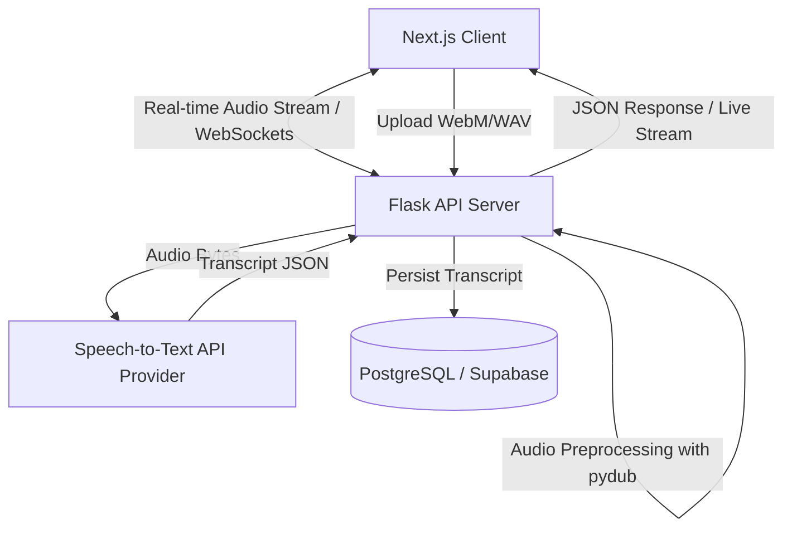

# Speech-to-Text Application (Python Full Stack)

A modern full-stack web application that records audio via the user's microphone, processes the audio stream, and transcribes the speech to readable text using state-of-the-art Speech-to-Text APIs (e.g., DeepInfra or Google Cloud STT).

---

## 🏗️ Architecture & Component Design



---

## 🎨 Wireframe Sketches (UI/UX Mockups)

### 1. Recording & Live Transcript Screen
This is the primary workspace where users control audio capture and view results as they are transcribed.

```text
+-----------------------------------------------------------------------------------+
|  [🎤 STT App]                Record             History             [User Profile] |
+-----------------------------------------------------------------------------------+
|                                                                                   |
|                              --- Voice Recorder ---                               |
|                                                                                   |
|                                     +-------+                                     |
|                                     |  🎤   |  <- Click to Record                 |
|                                     +-------+                                     |
|                                                                                   |
|                                  [00:00:00] (Ready)                               |
|                                                                                   |
|  +-----------------------------------------------------------------------------+  |
|  | Live Transcript                                                             |  |
|  | --------------------------------------------------------------------------- |  |
|  | (Spoken words will appear here in real-time...)                             |  |
|  |                                                                             |  |
|  |                                                                             |  |
|  +-----------------------------------------------------------------------------+  |
|                                                                                   |
|                     [ Copy Text ]  [ Download TXT ]  [ Save to DB ]                |
|                                                                                   |
+-----------------------------------------------------------------------------------+
```

### 2. Transcript History Screen
Enables users to manage, search, and download their archived speech transcriptions.

```text
+-----------------------------------------------------------------------------------+
|  [🎤 STT App]                Record            *History*            [User Profile] |
+-----------------------------------------------------------------------------------+
|                                                                                   |
|                              --- Saved Transcripts ---                            |
|                                                                                   |
|  Search transcripts: [ Find a transcript...                                     ] |
|                                                                                   |
|  +-----------------------------------------------------------------------------+  |
|  | Date        | Text Summary                         | Duration | Actions     |  |
|  | ------------+--------------------------------------+----------+------------ |  |
|  | May 21, 2026| "Meeting notes regarding marketing..."| 00:04:12 | [View] [Del]|  |
|  | May 20, 2026| "Ideas for the new project layout..."| 00:01:45 | [View] [Del]|  |
|  | May 18, 2026| "Speech recognition test recording..." | 00:00:30 | [View] [Del]|  |
|  +-----------------------------------------------------------------------------+  |
|                                                                                   |
|                                <<  [1]  2  3  >>                                  |
|                                                                                   |
+-----------------------------------------------------------------------------------+
```

---

## 🛠️ Stack & Technologies

*   **Frontend:** [Next.js](https://nextjs.org/) (React), Tailwind CSS, TypeScript, Axios
*   **Backend:** [Flask](https://flask.palletsprojects.com/) (Python), Flask-CORS, Flask-SocketIO (for streaming), PyDub
*   **Speech Recognition:** DeepInfra Speech-to-Text API, or Google Speech-to-Text API
*   **Database:** Supabase (PostgreSQL)
*   **Development Tools:** Git, Python Venv, Npm/Yarn

---

## 📂 Repository Structure

```text
├── frontend/             # Next.js Client App
├── backend/              # Flask Server App & Venv
├── .gitignore            # Git exclusion guidelines
├── .env.example          # Project configuration template
├── LICENSE               # MIT License File
└── README.md             # Project roadmap and architecture overview (this file)
```

---

## 📅 14-Day Development Roadmap

*   **Day 1:** Project Scaffolding & Configuration setup [CURRENT STAGE]
*   **Day 2:** Frontend UI skeleton (Tailwind CSS configuration and pages layout)
*   **Day 3:** Microphone audio capturing using MediaRecorder (Blob assembly)
*   **Day 4:** Backend Flask skeleton (accept multipart uploads endpoint)
*   **Day 5:** Speech-to-Text provider integration proof-of-concept
*   **Day 6:** E2E integration (frontend upload, backend processing, transcript render)
*   **Day 7:** Robust server-side audio format conversion & validations using PyDub
*   **Day 8:** WebSocket-based live audio chunk streaming & partial transcribing (Optional)
*   **Day 9:** Supabase integration for transcripts archiving (Database & History screen)
*   **Day 10:** User accounts and auth integration for private archives (Supabase Auth)
*   **Day 11:** UI polishing and export features (Copy, Download .txt, Docx export)
*   **Day 12:** Multi-browser QA and automated/manual tests (pytest & E2E)
*   **Day 13:** Flask Deployment (Render/Heroku) & Frontend Deployment (Vercel)
*   **Day 14:** Final documentation review, demos, and project sign-off
