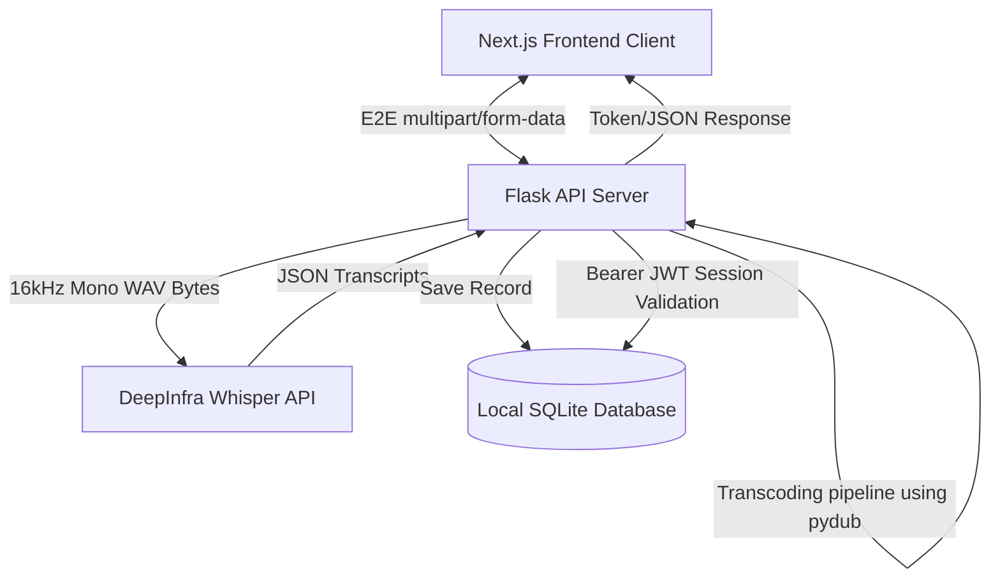

# EchoScribe - Speech-to-Text Application (Full Stack)

EchoScribe is a modern, full-stack web application designed for high-fidelity microphone voice capture, real-time transcription processing, and personal archive management. It utilizes a Next.js frontend styled with a clean glassmorphic aesthetic and a secure Python Flask backend utilizing Whisper Speech-to-Text services and SQL database persistence.

---

## 🏗️ System Architecture & Workflow



---

## 🎨 UI Dashboards (Wireframes)

### 1. Recording Dashboard (Home)
```text
+-----------------------------------------------------------------------------------+
|  [🎤 EchoScribe]             Record             History              [User Profile] |
+-----------------------------------------------------------------------------------+
|                                                                                   |
|                              --- Voice Recorder ---                               |
|                                                                                   |
|                                     +-------+                                     |
|                                     |  🎤   |  <- Click to Record                 |
|                                     +-------+                                     |
|                                                                                   |
|                                  [00:00:15] (Recording)                           |
|                                                                                   |
|  +-----------------------------------------------------------------------------+  |
|  | Live Transcript                                                             |  |
|  | --------------------------------------------------------------------------- |  |
|  | Hello world, this is EchoScribe recording live speech...                    |  |
|  |                                                                             |  |
|  |                                                                             |  |
|  +-----------------------------------------------------------------------------+  |
|                                                                                   |
|         [ Copy Text ]  [ Download TXT ]  [ Download DOC ]  [ Save Transcript ]     |
|                                                                                   |
+-----------------------------------------------------------------------------------+
```

### 2. Archive Panel
```text
+-----------------------------------------------------------------------------------+
|  [🎤 EchoScribe]             Record            *History*             [User Profile] |
+-----------------------------------------------------------------------------------+
|                                                                                   |
|                              --- Saved Transcripts ---                            |
|                                                                                   |
|  Search transcripts: [ alex_stone                                               ] |
|                                                                                   |
|  +-----------------------------------------------------------------------------+  |
|  | Date        | Text Summary                         | Duration | Actions     |  |
|  | ------------+--------------------------------------+----------+------------ |  |
|  | May 28, 2026| "Meeting notes regarding marketing..."| 00:04:12 | [View] [Del]|  |
|  | May 26, 2026| "Hello world, this is EchoScribe..." | 00:00:15 | [View] [Del]|  |
|  +-----------------------------------------------------------------------------+  |
|                                                                                   |
+-----------------------------------------------------------------------------------+
```

---

## 🛠️ Technology Stack

*   **Frontend:** Next.js (App Router), React, TypeScript, Tailwind CSS
*   **Backend:** Python 3.8+, Flask, Flask-CORS, PyDub (for audio processing)
*   **Speech Recognition:** DeepInfra Whisper-large-v3 API (with automatic mock fallback support)
*   **Database:** Local SQLite SQL Database (`transcripts.db`)
*   **Auth:** JWT-based itsdangerous Timed Serialization sessions

---

## 🚀 Environment Variables Configuration

Copy `.env.example` to create your own configuration files:

### Backend Configuration (`backend/.env`):
```ini
FLASK_APP=app.py
FLASK_ENV=development
PORT=5000
JWT_SECRET=your_custom_secure_secret_key
DEEPINFRA_API_KEY=your_deepinfra_api_key_here
```
*(Note: If no `DEEPINFRA_API_KEY` is provided, the server automatically boots in offline mock fallback mode, allowing you to test database savings, user registrations, and audio playback fully without configuring APIs.)*

### Frontend Configuration (`frontend/.env.local`):
```ini
NEXT_PUBLIC_API_URL=http://localhost:5000
```

---

## 💻 Full-Stack Local Execution

### 1. Run the Flask Backend:
Ensure you have Python 3.8+ and **FFmpeg** installed (required for audio transcoding).

```bash
# Navigate to backend folder
cd backend

# Activate Virtual Environment
# Windows (PowerShell):
.\venv\Scripts\Activate.ps1
# macOS/Linux:
source venv/bin/activate

# Install dependencies
pip install -r requirements.txt

# Start the Flask API server
python app.py
```
The backend server runs locally on **`http://localhost:5000`**.

### 2. Run the Next.js Frontend:
Ensure you have Node.js 18+ installed.

```bash
# Navigate to frontend folder
cd frontend

# Install Node dependencies
npm install

# Start the Next.js development server
npm run dev
```
Open [http://localhost:3000](http://localhost:3000) in your web browser to access the EchoScribe portal!
